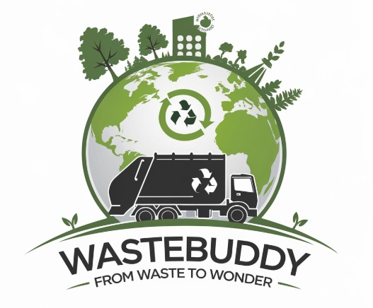

## **WASTEBUDDY – FROM WASTE TO WONDER**  

  

## **Demo:** https://kh-05-2025.onrender.com/

## **Overview**  
---
### **Revolutionizing Waste Management with AI and Sustainability**
**WASTEBUDDY** is an AI-powered platform transforming **domestic waste into valuable resources** through smart waste management, recycling, and sustainability. It enables users to **identify recyclable waste** via **AI image recognition**, consult an **AI chatbot**, and trade waste through a **marketplace**. Expired food is safely redirected to **food banks or composting centers**, while **AI-driven waste density analysis** optimizes collection points. Users earn **redeemable credits** for responsible disposal, track their **carbon footprint**, and engage with **gamified awareness tools**. WasteBuddy promotes **eco-friendly practices** through **technology, incentives, and collaboration**, building a cleaner and sustainable future. 🌍♻️

## **🌱 Inspiration** 
---

India produces over **60 million tons of domestic waste annually**, but **only 10% is properly treated**—the rest ends up in **landfills**, worsening pollution. One of the most **underutilized waste categories is fabric**, which remains **unrecycled in India** while major global brands like **H&M** already incorporate textile recycling.  

We realized that **waste producers (households & businesses)** could be **incentivized** to manage their waste **properly** if given financial motivation. This led to **WasteBuddy**, an **AI-driven solution** that helps people **segregate, recycle, and trade waste responsibly**, contributing to a **circular economy and a cleaner environment**.  

### 🌍 **Key Features** 
---

✅ **AI-Based Waste Identification** – Users can upload images to determine whether their waste is **recyclable or disposable**.  
✅ **AI Chatbot for Waste Queries** – Get **real-time answers** to waste disposal and recycling questions.  
✅ **Waste Marketplace** – Users can **list waste items** (paper, plastic, iron, fabric, wood, etc.) for potential buyers.  
✅ **Organic Waste Management** – **Expired food waste** is collected separately and **redirected to food banks or composting centers**.  
✅ **AI-Driven Waste Collection Optimization** – Smart **waste density analysis** ensures cost-effective transportation and collection.  
✅ **Credit System & Incentives** – Users earn **redeemable credit points** based on the **type and weight of waste contributed**.  
✅ **Carbon Footprint Calculator** – Helps users measure the **environmental impact of improper waste disposal**.  
✅ **Gamified Awareness (Flashcards)** – Engaging facts and quizzes to **spread awareness about waste management and sustainability**.  

## **📌 Tech Stack**
---

🔹 **Frontend:** ejs, css, Bootstrap

🔹 **Backend:** JavaScript, Nodejs, Expressjs, Python-Flask

🔹 **Database:** MongoAtlas 

🔹 **AI & ML:** Gemini API, Groclake, Plotch.ai 

🔹 **Cloud & Deployment:** Render & Cloudinary

🔹 **Libraries:** multer, socket.io

## **💰 Revenue Model** 
---

💼 **Subscription Plans** – Priority listings for sellers in the waste marketplace.  
📦 **Commission on Recycled Waste Sales** – Revenue from the sale of repurposed materials.  
🏛️ **Government & Corporate Partnerships** – Collaboration for **sustainability initiatives and funding**.  
🍲 **Food Waste Monetization** – Revenue from food banks that process and redistribute expired food items.  
🌿 **Government Subsidies** – Leveraging subsidies for sustainable waste management practices.  

## **Access and Reach**
---

### **Ensuring Accessibility for All Users**  
We believe that **effective waste management should be accessible to everyone**. To achieve this, **WasteBuddy** is built as a **mobile-friendly web platform** that ensures seamless access across all devices.  

- **Lightweight AI Models**: Optimized for **low-bandwidth environments**, ensuring that even users with **basic smartphones and limited internet access** can utilize the platform.  
- **Progressive Web App (PWA) Integration**: Enables **offline functionalities**, allowing users to access key features **without a stable internet connection**.  

### **Expanding Reach through Strategic Partnerships**  
To maximize impact, we aim to **collaborate with government agencies, NGOs, and sustainability-focused corporations** to enhance waste management infrastructure.  

- **Industry Partnerships for Recycling**: Engaging with **fabric recyclers, plastic processors, and composting organizations** to create a **circular waste economy**.  
- **Government & Municipal Support**: Seeking **policy integration and financial support** for large-scale implementation, ensuring **subsidies and incentives** for responsible waste disposal.  

🚀 **With these strategies, WasteBuddy is on a mission to create a cleaner, more sustainable future for all!** ♻️

## **What’s Next: Future Directions**  
-----

As we strive to revolutionize waste management and sustainability, our roadmap includes several innovative features that will enhance the efficiency and impact of **WasteBuddy**. Here’s what’s coming next:  

### 🌍 **AI-Enhanced Waste Sorting & Automation**  
We are working on **advanced AI-powered waste recognition** that will automatically classify and sort waste into recyclable, non-recyclable, and hazardous categories. This will **improve accuracy** and **streamline waste processing**, making sustainable disposal easier for users.  

### 🔗 **Blockchain for Waste Tracking & Transparency**  
To ensure **accountability and traceability**, we plan to integrate **blockchain technology** for **waste tracking**. This will provide **real-time data** on where waste is collected, how it is processed, and its final destination, promoting **transparency and trust** in the waste ecosystem.  

### ♻️ **Fabric Recycling & Textile Circular Economy**  
Currently, **fabric waste in India remains largely unutilized**, unlike in countries where major brands like **H&M** integrate textile recycling. We aim to **collaborate with industries** to introduce **fabric recycling initiatives**, preventing textile waste from ending up in landfills and promoting **sustainable fashion solutions**.  

### 📈 **Expanded Credit & Rewards System**  
To further **encourage responsible waste disposal**, we plan to introduce a **more dynamic rewards system**, where users can **redeem points for discounts, vouchers, or eco-friendly products**. This will **incentivize waste management efforts** while fostering a more sustainable mindset.  

## **Join Us in Building a Greener Future**  
---

At **WasteBuddy**, we believe that waste is **not just trash—it’s an opportunity**. By transforming waste into **valuable resources**, we can create a more **sustainable, circular economy** while benefiting individuals and businesses alike.  

🚀 **Together, let’s turn waste into wonder.** ♻️
